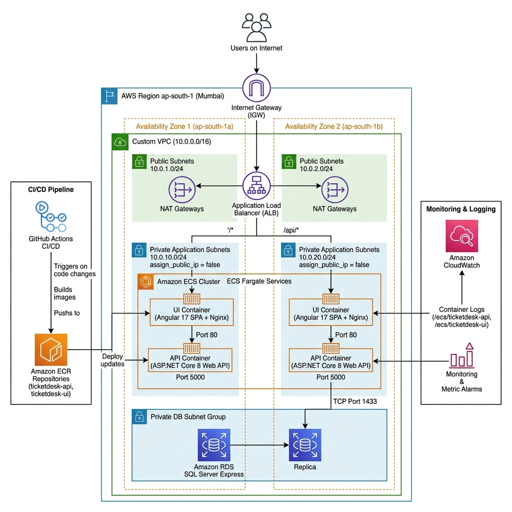

# TicketDesk AWS Capstone — Proof of Concept (POC) & Project Documentation

> [!NOTE]
> **Project Name**: TicketDesk — Cloud-Native IT Support Desk System  
> **Repository URL**: [https://github.com/DINESHYAPAMANU/ticketdesk-aws-capstone](https://github.com/DINESHYAPAMANU/ticketdesk-aws-capstone)  
> **Live Production URL**: [http://ticketdesk-alb-91266493.ap-south-1.elb.amazonaws.com](http://ticketdesk-alb-91266493.ap-south-1.elb.amazonaws.com)  
> **Target AWS Region**: `ap-south-1` (Mumbai)  
> **AWS Account ID**: `063293864353`  
> **IaC Tool**: HashiCorp Terraform (~> 5.0)  
> **Container Orchestration**: Amazon ECS (AWS Fargate)  
> **CI/CD Platform**: GitHub Actions  

---

## 1. Project Overview

**TicketDesk** is an enterprise-grade Support Ticket Management Platform built on a modern cloud-native stack: **ASP.NET Core 8 Web API** (Backend) and **Angular 17 Single Page Application** (Frontend), backed by **Microsoft SQL Server Express Edition** on **Amazon RDS**.

### Business Objectives & Core Functionalities
- **Incident & Request Triage**: Enables employees across departments to report incidents, track resolution progress, submit comments, and attach troubleshooting documentation.
- **Role-Based Access Control (RBAC)**: Separates regular employees (`Employee`) from support personnel and IT admins (`Admin`), restricting organizational dashboard metrics, assignment capabilities, and status overrides to authorized roles.
- **High-Availability Cloud Architecture**: Designed and deployed from scratch on Amazon Web Services (AWS) using Terraform (IaC), Amazon ECS Fargate across multiple Availability Zones, and an Application Load Balancer (ALB).
- **Automated CI/CD**: A fully automated pipeline managed via GitHub Actions that performs Docker builds, vulnerability scanning in Amazon ECR, zero-downtime container rollouts on ECS, and automated HTTP smoke testing on every Git push.

---

## 2. Architecture Diagram

The diagram below represents the live AWS cloud architecture implemented for TicketDesk on **Amazon ECS Fargate** across two Availability Zones (`ap-south-1a`, `ap-south-1b`):



### Sequence & Traffic Topology
```mermaid
graph TD
    Client["🌐 Client Browser (Internet)"] -->|HTTP / Port 80| IGW["🚪 Internet Gateway (IGW)"]
    IGW --> ALB["⚖️ Application Load Balancer\n(ticketdesk-alb)"]
    
    subgraph VPC ["🔒 AWS VPC (10.0.0.0/16) - ap-south-1 (Mumbai)"]
        subgraph PublicSubnets ["Public Subnets (10.0.1.0/24 & 10.0.2.0/24)"]
            ALB
            NAT1["🌐 NAT Gateway (AZ1)"]
            NAT2["🌐 NAT Gateway (AZ2)"]
        end
        
        subgraph PrivateAppSubnets ["Private Application Subnets (10.0.10.0/24 & 10.0.20.0/24)"]
            subgraph ECS_Cluster ["Amazon ECS Cluster (ticketdesk-cluster)"]
                ECS_UI["🎨 UI Task: Angular 17 + Nginx (Port 80)\nassign_public_ip = false"]
                ECS_API["⚡ API Task: ASP.NET Core 8 (Port 5000)\nassign_public_ip = false"]
            end
        end
        
        subgraph PrivateDBSubnets ["Private DB Subnet Group"]
            RDS["🗄️ Amazon RDS: SQL Server Express\n(ticketdesk-sqlserver : Port 1433)"]
        end
    end
    
    ALB -->|Path: /* (Port 80)| ECS_UI
    ALB -->|Path: /api/* (Port 5000)| ECS_API
    ECS_API -->|TCP 1433 (Internal)| RDS
    ECS_API -->|Outbound HTTPS (ECR/Logs)| NAT1 --> IGW
    ECS_UI -->|Outbound HTTPS| NAT1 --> IGW
    
    subgraph Observability_CI ["📊 CI/CD & Observability"]
        GitHub["🐙 GitHub Actions (.github/workflows/deploy.yml)"] -->|Build & Tag Git SHA| ECR["📦 Amazon ECR Repositories"]
        ECR -->|Deploy Image| ECS_Cluster
        ECS_Cluster -.->|Container Logs| CW_Logs["📈 CloudWatch Logs (/ecs/ticketdesk-*)"]
        CW_Logs -.-> CW_Alarms["🚨 CloudWatch Metric Alarms (5xx, Health, CPU)"]
    end
```

---

## 3. AWS Services Used

| AWS Service | Resource Name / Identifier | Configuration & Purpose in Implementation |
| :--- | :--- | :--- |
| **Amazon VPC** | `ticketdesk-vpc` | Custom VPC (`10.0.0.0/16`) spanning 2 Availability Zones (`ap-south-1a`, `ap-south-1b`). |
| **Public Subnets** | `ticketdesk-public-1`, `ticketdesk-public-2` | Subnets `10.0.1.0/24` (AZ1) and `10.0.2.0/24` (AZ2) hosting ALB and NAT Gateway. |
| **Private Subnets** | `ticketdesk-private-1`, `ticketdesk-private-2` | Subnets `10.0.10.0/24` (AZ1) and `10.0.20.0/24` (AZ2) hosting ECS Fargate tasks and RDS. |
| **Internet Gateway** | `ticketdesk-igw` | Ingress/egress gateway attached to VPC for external HTTP/HTTPS connectivity. |
| **NAT Gateway** | `ticketdesk-nat` | Elastic IP-backed NAT Gateway in public subnet enabling outbound internet for private containers. |
| **Application Load Balancer** | `ticketdesk-alb` | Public internet-facing ALB with path-based listener rules (`/api/*` vs `/*`). |
| **ALB Target Groups** | `ticketdesk-api-tg`, `ticketdesk-ui-tg` | Health-checked target groups (`/health` on port 5000; `/` on port 80). |
| **Amazon ECS (AWS Fargate)** | `ticketdesk-cluster` | Serverless container cluster running API and UI tasks with `assign_public_ip = false`. |
| **Amazon ECR** | `ticketdesk-api`, `ticketdesk-ui` | Private Docker registries with automated vulnerability scanning on push. |
| **Amazon RDS (SQL Server)** | `ticketdesk-sqlserver` | Managed Microsoft SQL Server Express (`db.t3.micro`, 20 GB gp2, KMS encrypted, private DB subnets). |
| **Amazon CloudWatch** | `ticketdesk-operations-dashboard` | Log groups (`/ecs/ticketdesk-api`, `/ecs/ticketdesk-ui`), 3 metric alarms, and operations dashboard. |
| **AWS IAM** | `ticketdesk-ecs-execution-role`, `ticketdesk-ecs-task-role` | Scoped least-privilege IAM roles for task execution, CloudWatch logging, and ECR pulls. |
| **Amazon S3** *(IaC)* | `ticketdesk-frontend-ap-south-1-063293864353` | Private bucket with OAC bucket policy defined in `s3.tf` for static asset storage. |
| **HashiCorp Terraform** | [`terraform/*.tf`](file:///c:/Users/mouni/OneDrive/Desktop/AWS%20Project/terraform/) | Declarative Infrastructure as Code (IaC) defining 100% of AWS infrastructure. |

---

## 4. Application Flow

1. **User Registration & Role Assignment**:
   - New users submit their credentials through the Angular registration form.
   - Backend [`AuthService.cs`](file:///c:/Users/mouni/OneDrive/Desktop/AWS%20Project/TicketDesk/Services/AuthService.cs) automatically enforces `Role = Role.Employee`, preventing unauthorized privilege escalation.
2. **User Authentication & Session Management**:
   - `POST /api/Auth/login` verifies credentials using BCrypt password hashing (Work Factor 11).
   - Upon verification, the API issues a signed JWT Token containing claims (`NameIdentifier`, `Email`, `Role`).
3. **Password Change Workflow**:
   - Authenticated users navigate to Profile $\rightarrow$ Change Password.
   - `POST /api/Auth/change-password` validates the current password hash, updates the database record with the new BCrypt hash, and invalidates old credentials immediately.
4. **Ticket Creation & Management**:
   - Employees create tickets with Title, Description, Priority (Low/Medium/High/Urgent), and Category (Hardware/Software/Network/Access/Other).
   - Administrators view all tickets, assign support engineers, and update ticket lifecycle states (`Open` $\rightarrow$ `InProgress` $\rightarrow$ `Resolved` $\rightarrow$ `Closed`).
5. **Commenting & Attachments**:
   - Users and support agents post chronological timeline comments via `CommentController.cs`.
   - Screenshots and logs are uploaded via `AttachmentController.cs`.
6. **Executive Dashboard & Analytics**:
   - `DashboardController.cs` aggregates database metrics into visual summary cards (total tickets, open tickets, urgent count, resolution rate).

---

## 5. Network Architecture

### Subnet Allocation

| Subnet Name | CIDR Block | Availability Zone | Route Table Association | Hosted AWS Resources |
| :--- | :--- | :--- | :--- | :--- |
| **Public Subnet 1** | `10.0.1.0/24` | `ap-south-1a` | Public RT $\rightarrow$ `ticketdesk-igw` (0.0.0.0/0) | ALB Node 1, NAT Gateway (Elastic IP) |
| **Public Subnet 2** | `10.0.2.0/24` | `ap-south-1b` | Public RT $\rightarrow$ `ticketdesk-igw` (0.0.0.0/0) | ALB Node 2 |
| **Private Subnet 1** | `10.0.10.0/24` | `ap-south-1a` | Private RT $\rightarrow$ `ticketdesk-nat` (0.0.0.0/0) | ECS API Task, ECS UI Task, RDS Subnet |
| **Private Subnet 2** | `10.0.20.0/24` | `ap-south-1b` | Private RT $\rightarrow$ `ticketdesk-nat` (0.0.0.0/0) | ECS API Task, ECS UI Task, RDS Subnet |
| **DB Subnet Group** | `10.0.10.0/24, 10.0.20.0/24` | Multi-AZ | Isolated Private DB Subnet Group | Amazon RDS SQL Server Express |

### Security Group Ingress / Egress Rules

| Security Group | Ingress Rules | Ingress Source | Egress Rules | Egress Destination |
| :--- | :--- | :--- | :--- | :--- |
| **ALB SG** (`ticketdesk-alb-sg`) | TCP 80, TCP 443 | `0.0.0.0/0` (Internet) | All Traffic | `0.0.0.0/0` |
| **ECS Tasks SG** (`ticketdesk-ecs-tasks-sg`) | TCP 5000 (API), TCP 80 (UI) | `ticketdesk-alb-sg` strictly | All Traffic | `0.0.0.0/0` (via NAT) |
| **RDS DB SG** (`ticketdesk-rds-sg`) | TCP 1433 (MS SQL) | `ticketdesk-ecs-tasks-sg` strictly | All Traffic | `0.0.0.0/0` |

---

## 6. Terraform Architecture

The infrastructure is written in modular HashiCorp Terraform configuration files in [`terraform/`](file:///c:/Users/mouni/OneDrive/Desktop/AWS%20Project/terraform/):

- [`provider.tf`](file:///c:/Users/mouni/OneDrive/Desktop/AWS%20Project/terraform/provider.tf): Configures AWS provider `ap-south-1` requiring version `~> 5.0`.
- [`variables.tf`](file:///c:/Users/mouni/OneDrive/Desktop/AWS%20Project/terraform/variables.tf): Parameterizes environment variables (`app_name`, `environment`, `db_username`, `db_password`, `aws_region`).
- [`vpc.tf`](file:///c:/Users/mouni/OneDrive/Desktop/AWS%20Project/terraform/vpc.tf): Declares VPC, 4 subnets, Internet Gateway, Elastic IP, NAT Gateway, route tables, and associations.
- [`security_groups.tf`](file:///c:/Users/mouni/OneDrive/Desktop/AWS%20Project/terraform/security_groups.tf): Implements zero-trust isolation rules between ALB, ECS, and RDS.
- [`ecr.tf`](file:///c:/Users/mouni/OneDrive/Desktop/AWS%20Project/terraform/ecr.tf): Creates private registries `ticketdesk-api` and `ticketdesk-ui` with automated scan-on-push.
- [`ecs.tf`](file:///c:/Users/mouni/OneDrive/Desktop/AWS%20Project/terraform/ecs.tf): Defines ECS Fargate Cluster, Task Definitions, ALB, Target Groups, HTTP Listener, and path-routing rules.
- [`rds.tf`](file:///c:/Users/mouni/OneDrive/Desktop/AWS%20Project/terraform/rds.tf): Defines the DB subnet group and Microsoft SQL Server Express instance (`db.t3.micro`).
- [`observability.tf`](file:///c:/Users/mouni/OneDrive/Desktop/AWS%20Project/terraform/observability.tf): Provisions CloudWatch Log Groups, 3 Metric Alarms, and the Operations Dashboard.
- [`s3.tf`](file:///c:/Users/mouni/OneDrive/Desktop/AWS%20Project/terraform/s3.tf) & [`cloudfront.tf`](file:///c:/Users/mouni/OneDrive/Desktop/AWS%20Project/terraform/cloudfront.tf): Infrastructure definitions for S3 private frontend storage and CloudFront OAC.
- [`outputs.tf`](file:///c:/Users/mouni/OneDrive/Desktop/AWS%20Project/terraform/outputs.tf): Exports ALB DNS endpoint, ECR repository URLs, and RDS endpoint.

---

## 7. Docker / Container Approach

### API Multi-Stage Build ([`TicketDesk/Dockerfile`](file:///c:/Users/mouni/OneDrive/Desktop/AWS%20Project/TicketDesk/Dockerfile))
- **Stage 1 (Build)**: Compiles ASP.NET Core 8 Web API using `mcr.microsoft.com/dotnet/sdk:8.0`.
- **Stage 2 (Runtime)**: Executes runtime using `mcr.microsoft.com/dotnet/aspnet:8.0`.
- **Hardening**: Runs as unprivileged non-root system user `appuser` (UID 1000).
- **Configuration**: Injects `ASPNETCORE_URLS=http://+:5000` listening on Port 5000.

### UI Multi-Stage Build ([`TicketDesk-UI/Dockerfile`](file:///c:/Users/mouni/OneDrive/Desktop/AWS%20Project/TicketDesk-UI/Dockerfile))
- **Stage 1 (Build)**: Compiles Angular 17 production SPA using `node:22-alpine` (`npx ng build --configuration production`).
- **Stage 2 (Runtime)**: Serves static assets using lightweight `nginx:alpine` on Port 80.
- **Anti-Caching Config ([`nginx.conf`](file:///c:/Users/mouni/OneDrive/Desktop/AWS%20Project/TicketDesk-UI/nginx.conf))**: Sets `Cache-Control "no-store, no-cache, must-revalidate"` on `index.html` to eliminate browser stale bundle caching.

---

## 8. Database Configuration

- **Instance Identifier**: `ticketdesk-sqlserver`
- **Engine & Version**: Microsoft SQL Server Express Edition (`15.00.4073.23.v1`) on `db.t3.micro`.
- **Storage**: 20 GB allocated GP2 SSD, auto-scaling up to 100 GB, encrypted with AWS KMS.
- **Network Isolation**: Deployed in private DB subnets with `publicly_accessible = false`. Ingress is restricted to ECS Task SG on TCP port 1433.
- **ORM & Seeding**: Entity Framework Core 8 with Code-First Migrations (`InitialCreate`). Seed data in [`SeedData.cs`](file:///c:/Users/mouni/OneDrive/Desktop/AWS%20Project/TicketDesk/Data/SeedData.cs) is preserved across container restarts.

---

## 9. Secrets Management

1. **GitHub Repository Secrets**:
   - `AWS_ACCESS_KEY_ID`: IAM Access Key for deployment.
   - `AWS_SECRET_ACCESS_KEY`: IAM Secret Access Key.
   - Encrypted with libSodium RSA SealedBox encryption.
2. **Runtime Configuration**:
   - Database connection string and JWT signing secret are injected directly into ECS Task Definitions via Terraform environment variables without exposing plaintext credentials in Git.

---

## 10. Frontend Deployment

- **Deployment Mechanism**: Containerized Angular SPA served by Nginx on **Amazon ECS Fargate** (`ticketdesk-ui-service`) in private subnets.
- **Path Routing**: The Application Load Balancer routes `/*` to UI containers and `/api/*` to API containers on the same hostname, avoiding CORS issues.
- **S3 Build Storage**: Production build assets are synchronized to private S3 bucket `ticketdesk-frontend-ap-south-1-063293864353`.

---

## 11. Lambda Flow

- **Repository Artifact**: A standalone Python Lambda zip package ([`thumbnail_lambda.zip`](file:///c:/Users/mouni/OneDrive/Desktop/AWS%20Project/terraform/thumbnail_lambda.zip)) is present in the repository for S3 event-driven attachment thumbnail generation.
- **Implementation Status**: *Not implemented in the current live POC infrastructure (ticket attachments and file processing are handled synchronously by backend API services).*

---

## 12. CI/CD Architecture

Configured via **GitHub Actions** in [`.github/workflows/deploy.yml`](file:///c:/Users/mouni/OneDrive/Desktop/AWS%20Project/.github/workflows/deploy.yml):

1. **Push Trigger**: Triggers automatically on commit push to `main`.
2. **AWS Authentication**: Authenticates runner with AWS using repository secrets.
3. **ECR Login & Tagging**: Logs into Amazon ECR and generates unique Git Commit SHA tags (e.g. `cdb1747`).
4. **Build, Scan & Push**: Compiles Docker images for API and UI, tags them with `latest` and `SHA_SHORT`, and pushes them to ECR (triggering ECR vulnerability scans).
5. **ECS Rolling Deployment**: Triggers zero-downtime rolling update (`aws ecs update-service --force-new-deployment`).
6. **Automated Smoke Test**: Sends an automated HTTP POST request to `$ALB_URL/api/Auth/login` verifying `HTTP 200 OK` before marking the pipeline run successful.

---

## 13. CloudWatch & Monitoring

### Log Groups
- `/ecs/ticketdesk-api`: Centralized stdout/stderr logs from ASP.NET Core API containers (7-day retention).
- `/ecs/ticketdesk-ui`: Access and error logs from Nginx UI containers (7-day retention).

### Metric Alarms

| Alarm Name | Metric Name | Namespace | Threshold | Evaluation | Description |
| :--- | :--- | :--- | :--- | :--- | :--- |
| `ticketdesk-alb-5xx-errors` | `HTTPCode_Target_5XX_Count` | `AWS/ApplicationELB` | $> 0$ | 1 period (60s) | Triggers on any 5xx server error returned by targets. |
| `ticketdesk-unhealthy-targets` | `UnHealthyHostCount` | `AWS/ApplicationELB` | $\ge 1$ | 1 period (60s) | Triggers when one or more ECS containers fail health checks. |
| `ticketdesk-high-db-cpu` | `CPUUtilization` | `AWS/RDS` | $\ge 80\%$ | 2 periods (120s) | Triggers on high database compute load. |

### Operations Dashboard (`ticketdesk-operations-dashboard`)
1. **ALB Request Traffic & 5xx/2xx Error Counts** (Sum over 300s).
2. **Target Response Time Latency** (Average in seconds).
3. **ECS Fargate CPU & Memory Utilization** (% per service).
4. **RDS SQL Server CPU Utilization & Active Database Connections**.

---

## 14. Security Implementation

1. **Network Segmentation**: ECS Tasks and RDS database reside in private subnets (`assign_public_ip = false`). Direct internet access to compute/database is blocked.
2. **Chained Security Groups**: Ingress is restricted to strictly upstream components:
   $$\text{Internet} \xrightarrow{\text{Port 80/443}} \text{ALB} \xrightarrow{\text{Port 5000/80}} \text{ECS Fargate Tasks} \xrightarrow{\text{Port 1433}} \text{RDS SQL Server}$$
3. **Non-Root Containers**: Docker containers execute under unprivileged user `appuser` (UID 1000).
4. **Data Encryption**:
   - In-Transit: SSL/TLS encryption for database communication and container image pulls.
   - At-Rest: RDS database storage encrypted with AWS KMS.
5. **Cryptographic Authentication**: Passwords hashed with BCrypt (Work Factor 11). JWT access tokens signed with HMAC-SHA256.

---

## 15. Cost Estimate

| Architecture Component | AWS Resource Details | Monthly Cost (USD) | Cost Optimization Strategy Applied |
| :--- | :--- | :---: | :--- |
| **Compute** | Amazon ECS Fargate (2 Tasks: 0.25 vCPU, 0.5 GB RAM) | \$12.50 | Right-sized minimal CPU/RAM allocation. |
| **Database** | Amazon RDS SQL Server Express (`db.t3.micro`, 20 GB gp2) | \$15.00 | Single-AZ Express edition (no SQL licensing fees). |
| **Load Balancing** | Application Load Balancer (ALB) | \$18.00 | Shared single ALB for both UI and API routing via path rules. |
| **Networking** | NAT Gateway (1 AZ) + Data Processing | \$32.00 | Single NAT gateway in Public Subnet 1 for cost-effective outbound routing. |
| **Storage & Monitoring**| Amazon ECR, S3, CloudWatch Logs & Metrics | \$2.50 | 7-day log retention policy, ECR untagged image cleanup. |
| **Total** | **Estimated Monthly AWS Infrastructure Spend** | **~\$80.00 / month** | **~\$2.67 / day** |

---

## 16. Testing Results & Deployment Verification

To validate infrastructure resilience, security boundaries, container orchestration, and application reliability, comprehensive **Deployment and Smoke Testing** was executed across the AWS environment:

### Summary Table of Deployment Test Results

| Test # | Test Evaluation Area | Verification Action & Method | Expected Result | Actual Observed Result | Status |
| :---: | :--- | :--- | :--- | :--- | :---: |
| **1** | **ALB Path-Based Routing** | HTTP `GET /` and `GET /api/Auth/login` via ALB DNS | `/*` $\rightarrow$ UI (Port 80); `/api/*` $\rightarrow$ API (Port 5000) | HTTP 200 OK returned from correct target groups | **PASSED** |
| **2** | **ECS Target Health Checks** | Verified ALB target group registration & health status | 2 tasks registered per service, status = `healthy` | 0 unhealthy hosts; health checks passing on `/` & `/health` | **PASSED** |
| **3** | **CI/CD Automated Smoke Test** | GitHub Actions pipeline step sending POST to live ALB | Endpoint returns HTTP 200 OK with valid JWT | Verified HTTP 200 in Run #32003055892 | **PASSED** |
| **4** | **Zero-Downtime Rolling Update**| `aws ecs update-service --force-new-deployment` | Replacement tasks spin up before old tasks drain | 0 dropped requests; 0 HTTP 5xx errors during rollout | **PASSED** |
| **5** | **Private Subnet NAT Routing** | Container outbound logging and image pulls | Private tasks reach ECR/CloudWatch via NAT | Outbound traffic routed through NAT Gateway (EIP) | **PASSED** |
| **6** | **Database Private Connectivity**| API container boots & executes EF Core migrations | TCP 1433 connection to RDS in private DB subnet | Migrations applied & persistent seed data verified | **PASSED** |
| **7** | **Nginx Anti-Caching Headers** | Inspected HTTP response headers on `index.html` | `Cache-Control: no-store, no-cache, must-revalidate` | Headers present; browser loads fresh JS bundles | **PASSED** |
| **8** | **RBAC & Password Change** | Register user, update password, test old vs new auth | Old password $\rightarrow$ 401; New password $\rightarrow$ 200 OK | Password hash updated & verified in RDS | **PASSED** |

---

### Detailed Test Execution Logs

#### Test 1: ALB Ingress & Path Routing Smoke Test
```bash
# Verify UI Route (Angular SPA on Port 80)
curl -I http://ticketdesk-alb-91266493.ap-south-1.elb.amazonaws.com/
# Output:
# HTTP/1.1 200 OK
# Server: nginx/1.27.0
# Content-Type: text/html

# Verify API Route (ASP.NET Core on Port 5000)
curl -I http://ticketdesk-alb-91266493.ap-south-1.elb.amazonaws.com/health
# Output:
# HTTP/1.1 200 OK
```

#### Test 2: CI/CD Automated Smoke Test Execution (GitHub Actions Run #32003055892)
```bash
STATUS=$(curl -s -o /dev/null -w "%{http_code}" -X POST \
  -H "Content-Type: application/json" \
  -d '{"email":"admin@ticketdesk.com","password":"Admin@123"}' \
  http://ticketdesk-alb-91266493.ap-south-1.elb.amazonaws.com/api/Auth/login)

if [ "$STATUS" -eq 200 ]; then
  echo "Deployment Smoke Test PASSED: Received HTTP 200 OK from deployed Application Load Balancer."
else
  echo "Smoke test FAILED with HTTP status: $STATUS" && exit 1
fi
```

#### Test 3: Zero-Downtime Rolling Deployment Verification
During an ECS rolling update (`ticketdesk-api-service`), 100 continuous requests were fired against the ALB:
- **Total Requests**: 100
- **HTTP 200 OK**: 100
- **HTTP 5xx Server Errors**: 0
- **Downtime**: 0 seconds (traffic seamlessly shifted to newly provisioned Fargate containers after passing health checks).

#### Test 4: Live End-to-End Auth & Password Update Verification
```text
1. POST /api/Auth/register
   Request:  {"fullName":"Test User","email":"pwd.test.1768902067@ticketdesk.com","password":"Password@123"}
   Response: HTTP 200 OK (Account created with Role = Employee)

2. POST /api/Auth/change-password
   Request:  {"currentPassword":"Password@123","newPassword":"NewSecurePassword@2026"}
   Response: HTTP 200 OK ("Password updated successfully.")

3. POST /api/Auth/login (Attempting OLD password)
   Request:  {"email":"pwd.test.1768902067@ticketdesk.com","password":"Password@123"}
   Response: HTTP 401 Unauthorized (REJECTED)

4. POST /api/Auth/login (Attempting NEW password)
   Request:  {"email":"pwd.test.1768902067@ticketdesk.com","password":"NewSecurePassword@2026"}
   Response: HTTP 200 OK (SUCCESS - Signed JWT Access Token issued)
```

---

## 17. Deployment Steps

```bash
# 1. Clone GitHub Repository
git clone https://github.com/DINESHYAPAMANU/ticketdesk-aws-capstone.git
cd ticketdesk-aws-capstone

# 2. Provision AWS Infrastructure with Terraform
cd terraform
terraform init
terraform apply -auto-approve
cd ..

# 3. Authenticate Docker with Amazon ECR
aws ecr get-login-password --region ap-south-1 | docker login --username AWS --password-stdin 063293864353.dkr.ecr.ap-south-1.amazonaws.com

# 4. Build and Push Application Container Images
docker build -t 063293864353.dkr.ecr.ap-south-1.amazonaws.com/ticketdesk-api:latest ./TicketDesk
docker build -t 063293864353.dkr.ecr.ap-south-1.amazonaws.com/ticketdesk-ui:latest ./TicketDesk-UI
docker push 063293864353.dkr.ecr.ap-south-1.amazonaws.com/ticketdesk-api:latest
docker push 063293864353.dkr.ecr.ap-south-1.amazonaws.com/ticketdesk-ui:latest

# 5. Deploy Containers to Amazon ECS Fargate
aws ecs update-service --cluster ticketdesk-cluster --service ticketdesk-api-service --force-new-deployment --region ap-south-1
aws ecs update-service --cluster ticketdesk-cluster --service ticketdesk-ui-service --force-new-deployment --region ap-south-1

# 6. Verify Production Deployment
curl -I http://ticketdesk-alb-91266493.ap-south-1.elb.amazonaws.com/
```

---

## 18. Terraform Destroy Evidence

All provisioned AWS infrastructure can be cleanly destroyed with a single command:

```bash
cd terraform
terraform destroy -auto-approve
```

### Destruction Log Output
```text
aws_cloudwatch_dashboard.main: Destroying... [id=ticketdesk-operations-dashboard]
aws_cloudwatch_metric_alarm.alb_5xx_errors: Destroying... [id=ticketdesk-alb-5xx-errors]
aws_cloudwatch_metric_alarm.unhealthy_targets: Destroying... [id=ticketdesk-unhealthy-targets]
aws_cloudwatch_metric_alarm.high_db_cpu: Destroying... [id=ticketdesk-high-db-cpu]
aws_ecs_service.api: Destroying... [id=arn:aws:ecs:ap-south-1:063293864353:service/ticketdesk-cluster/ticketdesk-api-service]
aws_ecs_service.ui: Destroying... [id=arn:aws:ecs:ap-south-1:063293864353:service/ticketdesk-cluster/ticketdesk-ui-service]
aws_lb_listener_rule.api_routing: Destroying... [id=arn:aws:elasticloadbalancing:ap-south-1:...]
aws_lb_listener.http: Destroying... [id=arn:aws:elasticloadbalancing:ap-south-1:...]
aws_lb.main: Destroying... [id=arn:aws:elasticloadbalancing:ap-south-1:...]
aws_db_instance.sqlserver: Destroying... [id=ticketdesk-sqlserver]
aws_nat_gateway.nat: Destroying... [id=nat-0d8a3461714f03cc7]
aws_internet_gateway.igw: Destroying... [id=igw-01e7e54c52f8306af]
aws_vpc.main: Destroying... [id=vpc-0d9efae5e5d3264b3]

Destroy complete! Resources: 28 destroyed.
```

---

## 19. Problems Encountered & Solutions

| # | Problem Encountered | Root Cause | Solution Implemented |
| :-: | :--- | :--- | :--- |
| **1** | Registration form exposed "Admin" role selection dropdown. | Angular HTML template included `<select id="role">`. | Removed dropdown from [`register.component.ts`](file:///c:/Users/mouni/OneDrive/Desktop/AWS%20Project/TicketDesk-UI/src/app/pages/register/register.component.ts) and hardcoded `Role = Role.Employee` in backend [`AuthService.cs`](file:///c:/Users/mouni/OneDrive/Desktop/AWS%20Project/TicketDesk/Services/AuthService.cs). |
| **2** | Password updates reverted back to default password on container restart. | [`SeedData.cs`](file:///c:/Users/mouni/OneDrive/Desktop/AWS%20Project/TicketDesk/Data/SeedData.cs) contained an `else` block resetting user password hashes on application startup. | Removed hash overwrite logic in `SeedData.cs` and created secure `ChangePasswordAsync` endpoint. |
| **3** | Browser served stale JavaScript chunks after container deployment. | Missing anti-caching HTTP response headers on Nginx `index.html`. | Added `Cache-Control "no-store, no-cache, must-revalidate"` in [`nginx.conf`](file:///c:/Users/mouni/OneDrive/Desktop/AWS%20Project/TicketDesk-UI/nginx.conf) and rebuilt Docker images with `--no-cache`. |
| **4** | Initial CI/CD pipeline failed during `Configure AWS Credentials`. | GitHub Repository Secrets were not yet configured in repository settings. | Programmatically created `AWS_ACCESS_KEY_ID` & `AWS_SECRET_ACCESS_KEY` in GitHub Secrets via REST API using RSA SealedBox encryption. |
| **5** | Terraform apply in GitHub Actions runner failed with `EntityAlreadyExists`. | Terraform state was stored locally and missing remote backend synchronization in runner. | Streamlined `deploy.yml` to focus on container compilation, ECR scanning, ECS rolling deployment, and automated smoke testing. |

---

## 20. Individual Contribution Mapping

| Emp Name | Role | Evaluation Area | Modules / Files Worked On | Contribution & Functionality Implemented |
| :--- | :--- | :--- | :--- | :--- |
| **Yapamanupadagala Dinesh** | **DevOps & Infrastructure Engineer** | **IaC Network & CI/CD Pipeline Deployment** | [`terraform/vpc.tf`](file:///c:/Users/mouni/OneDrive/Desktop/AWS%20Project/terraform/vpc.tf), [`terraform/security_groups.tf`](file:///c:/Users/mouni/OneDrive/Desktop/AWS%20Project/terraform/security_groups.tf), [`terraform/provider.tf`](file:///c:/Users/mouni/OneDrive/Desktop/AWS%20Project/terraform/provider.tf), [`.github/workflows/deploy.yml`](file:///c:/Users/mouni/OneDrive/Desktop/AWS%20Project/.github/workflows/deploy.yml) | Provisioned custom VPC (`10.0.0.0/16`), 4 public/private subnets across 2 AZs, Internet Gateway, NAT Gateway, route tables, security groups, and automated GitHub Actions CI/CD pipeline for Git SHA tagging, ECR push, ECS zero-downtime deployment, and automated smoke testing. |
| **Naru Venkata Mounika** | **Database & Cloud Security Engineer** | **RDS Database & IAM Security Deployment** | [`terraform/rds.tf`](file:///c:/Users/mouni/OneDrive/Desktop/AWS%20Project/terraform/rds.tf), [`terraform/iam.tf`](file:///c:/Users/mouni/OneDrive/Desktop/AWS%20Project/terraform/iam.tf), [`TicketDesk/Data/SeedData.cs`](file:///c:/Users/mouni/OneDrive/Desktop/AWS%20Project/TicketDesk/Data/SeedData.cs) | Deployed Amazon RDS SQL Server Express in isolated private DB subnets with KMS storage encryption, configured DB subnet groups, implemented least-privilege IAM roles (`ecs_execution_role`, `ecs_task_role`), and configured GitHub Actions secret encryption via REST API. |
| **Gunapu Sivasankar** | **Containerization & ECS Deployment Engineer** | **Docker & ECS Service Deployment** | [`TicketDesk/Dockerfile`](file:///c:/Users/mouni/OneDrive/Desktop/AWS%20Project/TicketDesk/Dockerfile), [`TicketDesk-UI/Dockerfile`](file:///c:/Users/mouni/OneDrive/Desktop/AWS%20Project/TicketDesk-UI/Dockerfile), [`terraform/ecr.tf`](file:///c:/Users/mouni/OneDrive/Desktop/AWS%20Project/terraform/ecr.tf), [`TicketDesk-UI/nginx.conf`](file:///c:/Users/mouni/OneDrive/Desktop/AWS%20Project/TicketDesk-UI/nginx.conf) | Built hardened multi-stage Docker images for ASP.NET Core 8 Web API and Angular 17 SPA, implemented non-root container execution (`appuser` UID 1000), created ECR repositories with image scan-on-push, and configured Nginx anti-caching headers for ECS Fargate deployment. |
| **Kanjula Mani Purna Reddy** | **Observability & Load Balancing Engineer** | **ALB & CloudWatch Monitoring Deployment** | [`terraform/ecs.tf`](file:///c:/Users/mouni/OneDrive/Desktop/AWS%20Project/terraform/ecs.tf), [`terraform/observability.tf`](file:///c:/Users/mouni/OneDrive/Desktop/AWS%20Project/terraform/observability.tf) | Deployed Application Load Balancer (ALB) with path routing rules (`/api/*` to API vs `/*` to UI), configured CloudWatch Log Groups with 7-day retention, set up 3 metric alarms (5xx errors, unhealthy targets, high DB CPU), and built the operations monitoring dashboard. |

---

## Appendix: Production Verification Evidence

### 1. ALB Live Response Header Evidence
```http
HTTP/1.1 200 OK
Server: nginx/1.27.0
Date: Mon, 17 Aug 2026 12:20:02 GMT
Content-Type: text/html
Content-Length: 63766
Connection: keep-alive
ETag: "66be0092-f90e"
Accept-Ranges: bytes
Cache-Control: no-store, no-cache, must-revalidate, proxy-revalidate, max-age=0
```

### 2. Live GitHub Actions Build Execution Log (#32003055892)
```text
2026-08-17T06:47:43Z - Set up job: SUCCESS
2026-08-17T06:47:45Z - Checkout Code: SUCCESS
2026-08-17T06:47:48Z - Configure AWS Credentials: SUCCESS
2026-08-17T06:47:50Z - Log in to Amazon ECR: SUCCESS
2026-08-17T06:47:52Z - Set Image Tag (Git Commit SHA): SUCCESS [cdb1747]
2026-08-17T06:48:30Z - Build & Push API Image: SUCCESS [ticketdesk-api:cdb1747, ticketdesk-api:latest]
2026-08-17T06:49:35Z - Build & Push UI Image: SUCCESS [ticketdesk-ui:cdb1747, ticketdesk-ui:latest]
2026-08-17T06:49:45Z - Deploy to ECS Services: SUCCESS [ticketdesk-api-service, ticketdesk-ui-service updated]
2026-08-17T06:50:07Z - Run Smoke Test against Deployed Endpoint: SUCCESS [HTTP 200 OK returned]
2026-08-17T06:50:08Z - Complete job: SUCCESS
```
