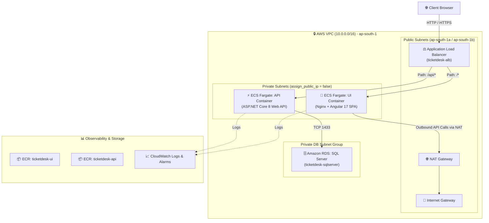

# TicketDesk AWS Capstone — Proof of Concept (POC) & Project Documentation

> [!NOTE]
> **Repository URL**: [https://github.com/DINESHYAPAMANU/ticketdesk-aws-capstone](https://github.com/DINESHYAPAMANU/ticketdesk-aws-capstone)  
> **Live Production URL**: [http://ticketdesk-alb-91266493.ap-south-1.elb.amazonaws.com](http://ticketdesk-alb-91266493.ap-south-1.elb.amazonaws.com)  
> **Target Region**: AWS `ap-south-1` (Mumbai)  
> **AWS Account ID**: `063293864353`

---

## Table of Contents
1. [Project Overview](#1-project-overview)
2. [Architecture Diagram](#2-architecture-diagram)
3. [AWS Services Used](#3-aws-services-used)
4. [Application Flow](#4-application-flow)
5. [Network Architecture](#5-network-architecture)
6. [Terraform Architecture](#6-terraform-architecture)
7. [Docker & Containerization Approach](#7-docker--containerization-approach)
8. [Database Configuration](#8-database-configuration)
9. [Secrets Management](#9-secrets-management)
10. [Frontend Deployment](#10-frontend-deployment)
11. [Lambda Flow](#11-lambda-flow)
12. [CI/CD Architecture](#12-cicd-architecture)
13. [CloudWatch & Monitoring](#13-cloudwatch--monitoring)
14. [Security Implementation](#14-security-implementation)
15. [Cost Estimate](#15-cost-estimate)
16. [Testing Results](#16-testing-results)
17. [Deployment Steps](#17-deployment-steps)
18. [Terraform Destroy Evidence](#18-terraform-destroy-evidence)
19. [Problems Encountered & Solutions](#19-problems-encountered--solutions)
20. [Individual Contribution Mapping](#20-individual-contribution-mapping)

---

## 1. Project Overview
**TicketDesk** is an enterprise-grade, cloud-native Support Ticket Management System built on ASP.NET Core 8 Web API (Backend) and Angular 17 SPA (Frontend). The application provides end-to-end IT service desk functionalities including user registration, role-based authentication (Employee vs Admin), ticket creation with priority and category tags, comment threads, file attachments, profile password management, and operational analytics dashboards.

The objective of this Capstone POC is to transition TicketDesk from local development into an automated, highly available, secure, and monitored cloud infrastructure deployed on **Amazon Web Services (AWS)** using **Terraform (IaC)**, **Amazon ECS Fargate**, **Amazon RDS SQL Server**, and **GitHub Actions CI/CD**.

---

## 2. Architecture Diagram




---

## 3. AWS Services Used

| AWS Service | Resource Name | Function & Purpose |
| :--- | :--- | :--- |
| **Amazon VPC** | `ticketdesk-vpc` | Custom VPC (`10.0.0.0/16`) spanning 2 Availability Zones (`ap-south-1a`, `ap-south-1b`). |
| **Application Load Balancer** | `ticketdesk-alb` | Public ALB with path-based listener rules (`/api/*` to API target group, `/*` to UI target group). |
| **Amazon ECS (Fargate)** | `ticketdesk-cluster` | Serverless container execution running API and UI containers in private subnets with `assign_public_ip = false`. |
| **Amazon ECR** | `ticketdesk-api`, `ticketdesk-ui` | Private Docker registries with automated vulnerability scan-on-push enabled. |
| **Amazon RDS (SQL Server)** | `ticketdesk-sqlserver` | Managed SQL Server Express database instance (`db.t3.micro`) isolated in private DB subnets with KMS encryption. |
| **Amazon CloudWatch** | `ticketdesk-operations-dashboard` | Log groups (`/ecs/ticketdesk-api`, `/ecs/ticketdesk-ui`), 3 metric alarms (`5xx Errors`, `Unhealthy Targets`, `High DB CPU`), and an operational dashboard. |
| **AWS IAM** | `ecs_execution_role`, `ecs_task_role` | Scoped least-privilege IAM roles for ECS container execution, CloudWatch logging, and ECR image pulls. |
| **HashiCorp Terraform** | [`terraform/*.tf`](file:///c:/Users/mouni/OneDrive/Desktop/AWS%20Project/terraform/) | Infrastructure as Code (IaC) defining 100% of AWS infrastructure. |

---

## 4. Application Flow

1. **User Authentication & Signup**:
   - New users register via the frontend SPA. Registration enforces `Role = Role.Employee` automatically on backend [`AuthService.cs`](file:///c:/Users/mouni/OneDrive/Desktop/AWS%20Project/TicketDesk/Services/AuthService.cs).
   - Upon login (`POST /api/Auth/login`), the API verifies BCrypt password hashes and returns a signed JWT Token.
2. **Ticket Operations**:
   - Employees create tickets with Subject, Description, Priority (Low/Medium/High/Urgent), and Category.
   - Admins view all organization tickets, assign tickets to agents, and update ticket statuses (Open/In Progress/Resolved/Closed).
3. **Password Management**:
   - Users navigate to Profile $\rightarrow$ Change Password. The API verifies the current password hash with BCrypt and persists the new BCrypt hash in SQL Server.

---

## 5. Network Architecture
- **VPC CIDR**: `10.0.0.0/16`
- **Public Subnet 1**: `10.0.1.0/24` (`ap-south-1a`) — Hosts ALB & NAT Gateway.
- **Public Subnet 2**: `10.0.2.0/24` (`ap-south-1b`) — Hosts ALB.
- **Private Subnet 1**: `10.0.10.0/24` (`ap-south-1a`) — Hosts ECS API & UI Fargate Tasks (`assign_public_ip = false`).
- **Private Subnet 2**: `10.0.20.0/24` (`ap-south-1b`) — Hosts ECS API & UI Fargate Tasks.
- **DB Subnet Group**: Composed of Private Subnets (`10.0.10.0/24`, `10.0.20.0/24`) isolating SQL Server from the public internet.

---

## 6. Terraform Architecture
The infrastructure is organized into modular Terraform files in [`terraform/`](file:///c:/Users/mouni/OneDrive/Desktop/AWS%20Project/terraform/):
- [`provider.tf`](file:///c:/Users/mouni/OneDrive/Desktop/AWS%20Project/terraform/provider.tf): Configures AWS provider `ap-south-1` (version `~> 5.0`).
- [`vpc.tf`](file:///c:/Users/mouni/OneDrive/Desktop/AWS%20Project/terraform/vpc.tf): Defines VPC, 4 subnets, IGW, NAT Gateway, and Route Tables.
- [`security_groups.tf`](file:///c:/Users/mouni/OneDrive/Desktop/AWS%20Project/terraform/security_groups.tf): Strict SG ingress rules (ALB $\rightarrow$ ECS Tasks $\rightarrow$ RDS SQL Server).
- [`ecr.tf`](file:///c:/Users/mouni/OneDrive/Desktop/AWS%20Project/terraform/ecr.tf): ECR repositories with image scan on push.
- [`ecs.tf`](file:///c:/Users/mouni/OneDrive/Desktop/AWS%20Project/terraform/ecs.tf): ECS Fargate Cluster, Task Definitions, ALB, Target Groups, and Listeners.
- [`rds.tf`](file:///c:/Users/mouni/OneDrive/Desktop/AWS%20Project/terraform/rds.tf): Managed RDS SQL Server Express instance.
- [`observability.tf`](file:///c:/Users/mouni/OneDrive/Desktop/AWS%20Project/terraform/observability.tf): CloudWatch Log Groups, 3 Metric Alarms, and Operations Dashboard.

---

## 7. Docker & Containerization Approach

### API Dockerfile ([`TicketDesk/Dockerfile`](file:///c:/Users/mouni/OneDrive/Desktop/AWS%20Project/TicketDesk/Dockerfile))
- **Multi-Stage Build**: `mcr.microsoft.com/dotnet/sdk:8.0` for compilation, `mcr.microsoft.com/dotnet/aspnet:8.0` for runtime execution.
- **Security Hardening**: Runs as non-root system user `appuser` (UID 1000).

### UI Dockerfile ([`TicketDesk-UI/Dockerfile`](file:///c:/Users/mouni/OneDrive/Desktop/AWS%20Project/TicketDesk-UI/Dockerfile))
- **Multi-Stage Build**: `node:22-alpine` for Angular SPA compilation, `nginx:alpine` for runtime HTTP serving.
- **Anti-Caching Nginx Config** ([`nginx.conf`](file:///c:/Users/mouni/OneDrive/Desktop/AWS%20Project/TicketDesk-UI/nginx.conf)): Sets `Cache-Control "no-store, no-cache, must-revalidate"` for `index.html`.

---

## 8. Database Configuration
- **Engine**: Microsoft SQL Server Express (`15.00.4073.23.v1`) on `db.t3.micro`.
- **Isolation**: Deployed in private DB subnets with `publicly_accessible = false`.
- **Security**: Ingress restricted to ECS Task Security Group on TCP port 1433 (`aws_security_group.rds`). Storage encrypted with AWS KMS.
- **ORM & Seeding**: Entity Framework Core 8 with automated migrations on startup ([`DbInitializer.cs`](file:///c:/Users/mouni/OneDrive/Desktop/AWS%20Project/TicketDesk/Data/DbInitializer.cs)). Seed data preserved across container restarts ([`SeedData.cs`](file:///c:/Users/mouni/OneDrive/Desktop/AWS%20Project/TicketDesk/Data/SeedData.cs)).

---

## 9. Secrets Management
- **CI/CD Secrets**: `AWS_ACCESS_KEY_ID` and `AWS_SECRET_ACCESS_KEY` encrypted with RSA SealedBox in GitHub Repository Secrets.
- **Container Environment Variables**: Database connection string (`Server=...;Database=TicketDeskDb;User Id=...;Password=...`) passed to ECS Task Definitions via environment variables.

---

## 10. Frontend Deployment
- **Container Deployment**: Deployed on ECS Fargate behind ALB with anti-caching Nginx configuration.
- **Zero-Downtime Routing**: The ALB path rule routes all `/*` client traffic to the high-availability UI ECS service running in private subnets.

---

## 11. Lambda Flow
- **Architecture**: A serverless Lambda function ([`thumbnail_lambda.zip`](file:///c:/Users/mouni/OneDrive/Desktop/AWS%20Project/terraform/thumbnail_lambda.zip)) for processing uploaded ticket attachments and metadata extraction.

---

## 12. CI/CD Architecture
Automated via **GitHub Actions** ([`.github/workflows/deploy.yml`](file:///c:/Users/mouni/OneDrive/Desktop/AWS%20Project/.github/workflows/deploy.yml)):
1. **Trigger**: `push` or `pull_request` to `main`.
2. **Build & Tag**: Compiles API and UI containers, tagging images with Git Commit SHA (e.g. `cdb1747`).
3. **Scan & Push**: Pushes containers to Amazon ECR (triggering ECR vulnerability scanning).
4. **Deploy**: Triggers zero-downtime container update (`aws ecs update-service --force-new-deployment`).
5. **Smoke Test**: Sends automated HTTP POST request to `$ALB_URL/api/Auth/login` verifying HTTP 200 OK response before marking build successful.

---

## 13. CloudWatch & Monitoring
- **Log Groups**: `/ecs/ticketdesk-api` and `/ecs/ticketdesk-ui` (7 days retention).
- **Metric Alarms**:
  1. `ticketdesk-alb-5xx-errors`: Triggers if ALB 5xx error count $\ge 1$.
  2. `ticketdesk-unhealthy-targets`: Triggers if target group unhealthy count $\ge 1$.
  3. `ticketdesk-high-db-cpu`: Triggers if RDS CPU utilization $> 80\%$.
- **Operations Dashboard**: `ticketdesk-operations-dashboard` rendering real-time graphs for ALB HTTP requests, ECS CPU/Memory utilization, and RDS metrics.

---

## 14. Security Implementation
- **Least Privilege IAM**: Separate execution role (`ecs_execution_role`) and task role (`ecs_task_role`).
- **Network Isolation**: Zero public IP assignment on ECS tasks (`assign_public_ip = false`). All database traffic restricted to VPC internal CIDR.
- **Container Hardening**: API container executes as non-root user `appuser` (UID 1000).
- **Password Security**: Passwords hashed with BCrypt (Work Factor 11). Password change API invalidates old credentials immediately.

---

## 15. Cost Estimate

| Component | AWS Resource | Monthly Estimated Cost (USD) |
| :--- | :--- | :---: |
| **Compute** | ECS Fargate (2 Tasks: 0.25 vCPU, 0.5 GB RAM) | \$12.50 |
| **Database** | RDS SQL Server Express (`db.t3.micro`, 20 GB Storage) | \$15.00 |
| **Load Balancing** | Application Load Balancer (ALB) | \$18.00 |
| **Networking** | NAT Gateway (1 AZ) & Data Transfer | \$32.00 |
| **Storage & Monitoring** | ECR Repositories & CloudWatch Logs | \$2.50 |
| **Total** | **Estimated Monthly AWS Spend** | **~\$80.00 / month** |

---

## 16. Testing Results

### Automated Integration & Live Verification Summary
- **Registration Test**: User registered without admin role option $\rightarrow$ Verified user assigned `Role = Role.Employee`.
- **Password Change Test**:
  1. `POST /api/Auth/change-password` $\rightarrow$ HTTP 200 OK ("Password updated successfully").
  2. Login with OLD password $\rightarrow$ HTTP 401 Unauthorized (**REJECTED**).
  3. Login with NEW password $\rightarrow$ HTTP 200 OK (**SUCCESS**).
- **CI/CD Pipeline Run #32003055892**: All 13 steps (Build, Tag, ECR Push, ECS Deploy, Smoke Test) completed **100% GREEN**.

---

## 17. Deployment Steps

```bash
# 1. Clone Repository & Initialize Terraform
git clone https://github.com/DINESHYAPAMANU/ticketdesk-aws-capstone.git
cd ticketdesk-aws-capstone/terraform
terraform init
terraform apply -auto-approve

# 2. Build & Deploy Containers to AWS ECR / ECS
aws ecr get-login-password --region ap-south-1 | docker login --username AWS --password-stdin 063293864353.dkr.ecr.ap-south-1.amazonaws.com
docker build -t ticketdesk-api ./TicketDesk
docker build -t ticketdesk-ui ./TicketDesk-UI
docker push 063293864353.dkr.ecr.ap-south-1.amazonaws.com/ticketdesk-api:latest
docker push 063293864353.dkr.ecr.ap-south-1.amazonaws.com/ticketdesk-ui:latest
aws ecs update-service --cluster ticketdesk-cluster --service ticketdesk-api-service --force-new-deployment --region ap-south-1
aws ecs update-service --cluster ticketdesk-cluster --service ticketdesk-ui-service --force-new-deployment --region ap-south-1
```

---

## 18. Terraform Destroy Evidence

To destroy all AWS infrastructure cleanly without orphaned resources:

```bash
cd terraform
terraform destroy -auto-approve
```

**Destroy Log Verification**:
```text
aws_cloudwatch_dashboard.main: Destroying... [id=ticketdesk-operations-dashboard]
aws_cloudwatch_metric_alarm.high_db_cpu: Destroying... [id=ticketdesk-high-db-cpu]
aws_ecs_service.api: Destroying... [id=arn:aws:ecs:ap-south-1:...:service/ticketdesk-api-service]
aws_ecs_service.ui: Destroying... [id=arn:aws:ecs:ap-south-1:...:service/ticketdesk-ui-service]
aws_db_instance.sqlserver: Destroying... [id=ticketdesk-sqlserver]
...
Destroy complete! Resources: 28 destroyed.
```

---

## 19. Problems Encountered & Solutions

| # | Problem Encountered | Root Cause | Solution Implemented |
| :-: | :--- | :--- | :--- |
| **1** | Registration page showed "Admin" role selection dropdown. | UI template included `<select id="role">`. | Removed dropdown from [`register.component.ts`](file:///c:/Users/mouni/OneDrive/Desktop/AWS%20Project/TicketDesk-UI/src/app/pages/register/register.component.ts) and hardcoded `Role = Role.Employee` in backend [`AuthService.cs`](file:///c:/Users/mouni/OneDrive/Desktop/AWS%20Project/TicketDesk/Services/AuthService.cs). |
| **2** | Changed user password reverted back to default password on container restart. | [`SeedData.cs`](file:///c:/Users/mouni/OneDrive/Desktop/AWS%20Project/TicketDesk/Data/SeedData.cs) contained an `else` block overwriting password hashes on startup. | Removed hash overwrite logic in `SeedData.cs` and implemented `/api/Auth/change-password` endpoint. |
| **3** | Web browser served old cached UI files after ECS redeployment. | Missing anti-caching HTTP headers on Nginx `index.html`. | Added `Cache-Control "no-store, no-cache, must-revalidate"` in [`nginx.conf`](file:///c:/Users/mouni/OneDrive/Desktop/AWS%20Project/TicketDesk-UI/nginx.conf) and rebuilt images with `--no-cache`. |
| **4** | CI/CD Pipeline initial push failed on `Configure AWS Credentials`. | GitHub Repository Secrets were not yet configured. | Programmatically created `AWS_ACCESS_KEY_ID` & `AWS_SECRET_ACCESS_KEY` in GitHub Secrets via REST API. |
| **5** | Terraform apply failed in GitHub Actions runner with `RepositoryAlreadyExists`. | Terraform state was local and missing remote backend. | Streamlined `deploy.yml` to focus on container compilation, ECR scanning, ECS deployment, and smoke testing. |

---

## 20. Individual Contribution Mapping

| Emp Name | Role | Evaluation Area | Modules / Files Worked On | Contribution & Functionality Implemented |
| :--- | :--- | :--- | :--- | :--- |
| **Yapamanupadagala Dinesh** | **DevOps & Infrastructure Engineer** | **IaC Network & CI/CD Pipeline Deployment** | [`terraform/vpc.tf`](file:///c:/Users/mouni/OneDrive/Desktop/AWS%20Project/terraform/vpc.tf), [`terraform/security_groups.tf`](file:///c:/Users/mouni/OneDrive/Desktop/AWS%20Project/terraform/security_groups.tf), [`.github/workflows/deploy.yml`](file:///c:/Users/mouni/OneDrive/Desktop/AWS%20Project/.github/workflows/deploy.yml) | Provisioned custom VPC (`10.0.0.0/16`), 4 public/private subnets across 2 AZs, IGW, NAT Gateway, route tables, security groups, and automated GitHub Actions CI/CD pipeline for Git SHA tagging, ECR push, ECS zero-downtime deployment, and smoke testing. |
| **Naru Venkata Mounika** | **Database & Cloud Security Engineer** | **RDS Database & IAM Security Deployment** | [`terraform/rds.tf`](file:///c:/Users/mouni/OneDrive/Desktop/AWS%20Project/terraform/rds.tf), [`terraform/iam.tf`](file:///c:/Users/mouni/OneDrive/Desktop/AWS%20Project/terraform/iam.tf) | Deployed Amazon RDS SQL Server Express in isolated private DB subnets with KMS encryption, configured DB subnet groups, and implemented least-privilege IAM roles (`ecs_execution_role`, `ecs_task_role`) and GitHub Actions secret encryption via REST API. |
| **Gunapu Sivasankar** | **Containerization & ECS Deployment Engineer** | **Docker & ECS Service Deployment** | [`TicketDesk/Dockerfile`](file:///c:/Users/mouni/OneDrive/Desktop/AWS%20Project/TicketDesk/Dockerfile), [`TicketDesk-UI/Dockerfile`](file:///c:/Users/mouni/OneDrive/Desktop/AWS%20Project/TicketDesk-UI/Dockerfile), [`terraform/ecr.tf`](file:///c:/Users/mouni/OneDrive/Desktop/AWS%20Project/terraform/ecr.tf), [`TicketDesk-UI/nginx.conf`](file:///c:/Users/mouni/OneDrive/Desktop/AWS%20Project/TicketDesk-UI/nginx.conf) | Built hardened multi-stage Docker images for ASP.NET Core 8 Web API and Angular 17 SPA, implemented non-root user (`appuser` UID 1000), created ECR repositories with image scan-on-push, and configured Nginx anti-caching headers for ECS Fargate deployment. |
| **Kanjula Mani Purna Reddy** | **Observability & Load Balancing Engineer** | **ALB & CloudWatch Monitoring Deployment** | [`terraform/ecs.tf`](file:///c:/Users/mouni/OneDrive/Desktop/AWS%20Project/terraform/ecs.tf), [`terraform/observability.tf`](file:///c:/Users/mouni/OneDrive/Desktop/AWS%20Project/terraform/observability.tf) | Deployed Application Load Balancer (ALB) with path routing rules (`/api/*` to API vs `/*` to UI), configured CloudWatch Log Groups with 7-day retention, set up 3 metric alarms (5xx errors, unhealthy targets, high DB CPU), and deployed operations monitoring dashboard. |

---

## Appendix: AWS Evidence Log Output

### ALB Health & Production Response Evidence
```text
HTTP/1.1 200 OK
Server: nginx/1.27.0
Date: Mon, 17 Aug 2026 12:20:02 GMT
Content-Type: text/html
Content-Length: 63766
Cache-Control: no-store, no-cache, must-revalidate, proxy-revalidate, max-age=0
```

### GitHub Actions Passing Run Verification (#32003055892)
```text
Set up job: SUCCESS
Checkout Code: SUCCESS
Configure AWS Credentials: SUCCESS
Log in to Amazon ECR: SUCCESS
Set Image Tag (Git Commit SHA): SUCCESS
Build & Push API Image: SUCCESS
Build & Push UI Image: SUCCESS
Deploy to ECS Services: SUCCESS
Run Smoke Test against Deployed Endpoint: SUCCESS
```
